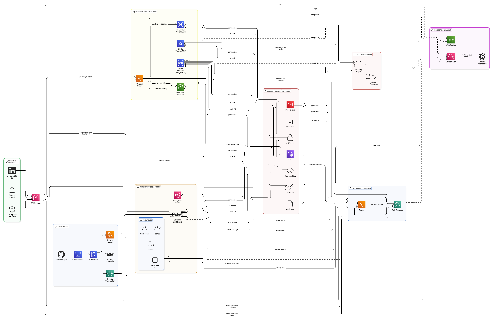

# SkillSage

**SkillSage** is a cloud-native platform designed to help job seekers understand current market demands by analyzing real-time job listings and comparing them with their resume. The goal is to highlight skill gaps and suggest learning paths, backed by data.

This project is being developed as part of a 30-day professional challenge to build and document a meaningful, technically sound data product using cloud services, automation, and NLP.

---

## Project Objectives

- Collect job listings and extract relevant skills using NLP
- Parse resumes and identify skills from uploaded files
- Compare job skill requirements against resume content
- Visualize skill gaps and trends using an interactive dashboard
- Automate regular data collection, processing, and updates using AWS

---

## Architecture Overview

The system consists of modular components for data ingestion, skill extraction, resume parsing, matching logic, and visualization. All workflows are designed to run in a secure, serverless cloud environment using AWS services.



---

## Technology Stack

- **Cloud Services:** AWS Lambda, RDS (PostgreSQL), S3, EventBridge, SNS, IAM
- **Programming:** Python, SQL
- **Libraries:** BeautifulSoup, spaCy, pdfplumber, pandas
- **Visualization:** Streamlit
- **Version Control:** Git, GitHub
- **DevOps (planned):** GitHub Actions / AWS CodePipeline

---

## Repository Structure

```
SkillSage/
├── ingestion/ # Job scraping logic and schedulers
├── nlp/ # Skill extraction logic
├── resume_matcher/ # Resume parser and skill comparison
├── dashboard/ # Streamlit app and visual components
├── database/ # SQL schema and queries
├── utils/ # Common helper functions
├── assets/ # Diagrams, screenshots, etc.
├── requirements.txt
├── .gitignore
└── README.md
```


---

## Build Timeline

| Day   | Milestone |
|-----|-----------|
| Day 1 | Project setup, folder structure, initial architecture |
| Day 2 | Pulled real job data from RemoteOK API and saved to CSV |
| Day 3 | Cleaned HTML from job descriptions and extracted raw skill-like phrases using spaCy |
| Day 4 | Improved skill extraction logic, curated a clean master skill list, and generated semantic embeddings using transformers for future job-skill matching |
| Day 5 | Pulled top 20 most in-demand skills from extracted data and visualized them using seaborn |
| Day 6 | Built interactive Streamlit dashboard to explore trending job skills      |
---

## Author

**Simi Mathew**  
Cloud & Data Engineer | AWS Certified | Passionate about real-world data products  
[LinkedIn](https://www.linkedin.com/in/-simi-mathew) | [GitHub](https://github.com/simimathew1898)

---

